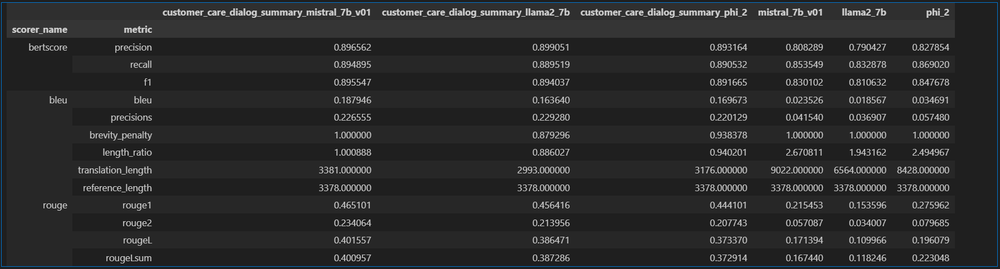

# Finetuning and Evaluating LLM's on summarization task
Currently finetuned and evaluted models
- meta-llama/Llama-2-7b-hf
- mistralai/Mistral-7B-v0.1
- microsoft/phi-2

### Installation
- package installation
```bash
pip install -e .
```
- requirements installation
```bash
pip install -r requirements.txt`
```

### Data
---
The Dataset is about Customer Support on Twitter conversation.

- download annotation key data from [Tweetsumm](https://github.com/guyfe/Tweetsumm) to `data` folder.
- download dialog text from [customer-support-on-twitter](https://www.kaggle.com/datasets/thoughtvector/customer-support-on-twitter) to `data` folder.
- Pre-process data then save it as json file.
```bash
python src/dataset/pre_process.py
```
- Push the json files to huggingface
```bash
python src/dataset/push_to_hub.py
```

### Finetune
---
- `config` folder has files that you can change hyperparameters.
```bash
python src/train.py ./config/mistral_v01.json
```

### Results

### thanks to 
- https://github.com/huggingface/transformers/blob/master/examples/pytorch/summarization/
- https://github.com/adityasihag1996/math_QA/blob/main/finetune.py